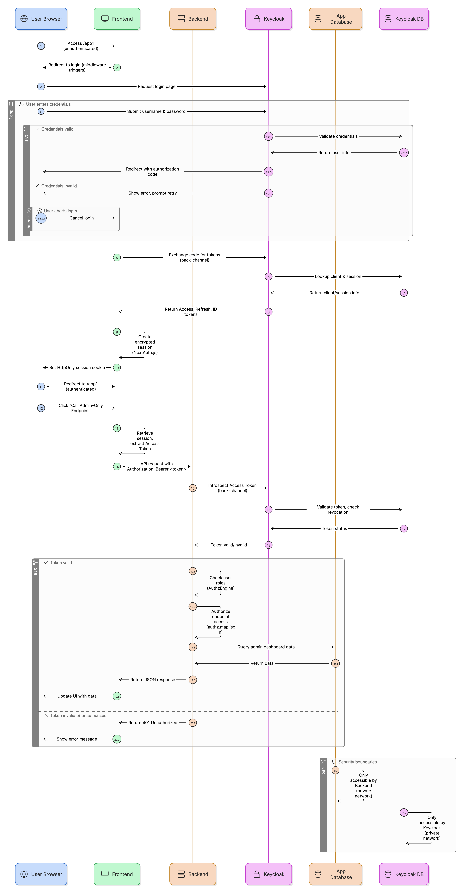

# AI Command Center - Full-Stack Template

This repository contains a production-ready, secure, and scalable template for building modern, AI-first web applications. It features a Python/FastAPI backend, a Next.js/React frontend, and Keycloak for identity management, all fully containerized with Docker and backed by PostgreSQL.

---

### ✨ Core Features

*   **Production-Ready Stack:** FastAPI, Next.js, PostgreSQL, and Keycloak working in harmony.
*   **Pluggable Authorization Engine:** Define complex, context-aware access control rules in simple JSON. Secure by default.
*   **Fully Containerized:** A consistent and reproducible development environment powered by Docker and Docker Compose.
*   **Excellent Developer Experience:** Get up and running with a single command. Includes out-of-the-box user roles, test accounts, database migrations, code formatting, and linting.
*   **AI-First Architecture:** Designed from the ground up to support building "AI Command Centers" where AI is a primary actor.

---

### 💻 Technology Stack

| Area      | Technology                                    | Purpose                                       |
|-----------|-----------------------------------------------|-----------------------------------------------|
| Backend   | **Python 3.11** with **FastAPI**              | High-performance, modern API development.     |
| Frontend  | **Next.js 15** with **React 19** & **TypeScript** | A robust framework for building user interfaces.  |
| Identity  | **Keycloak 24** on **PostgreSQL**             | Centralized, persistent, and scalable IAM.    |
| Database  | **PostgreSQL 15**                             | Reliable, feature-rich relational database.   |
| DevOps    | **Docker** & **Docker Compose**               | Containerization and service orchestration.     |

---

### ✅ Prerequisites

Ensure you have the following installed on your local machine:
*   [Docker](https://www.docker.com/get-started)
*   [Docker Compose](https://docs.docker.com/compose/install/) (usually included with Docker Desktop)
*   `make` (available on macOS and Linux, or via Chocolatey/WSL on Windows)

---

### 🚀 Getting Started

Follow these steps to get your local development environment running.

#### 1. Clone the Repository
```bash
git clone https://github.com/super-mohit/template.git
cd template
```

#### 2. Create Your Environment File
Copy the example environment file. This is your single source of truth for all local configuration.
```bash
cp .env.example .env
```

#### 3. Configure Secrets in `.env`
Open the newly created `.env` file. You must generate a secret for `NEXTAUTH_SECRET`. Run this command and paste the output into the file:
```bash
# Run this in your terminal and paste the output into the .env file
openssl rand -base64 32
```
**Good News:** The `KEYCLOAK_CLIENT_SECRET` is pre-configured to `supervity-is-super` for development. The template is ready to run out of the box!

#### 4. Update Your Hosts File
To ensure all services can communicate correctly on your local machine, add the following line to your system's hosts file:
```
127.0.0.1   keycloak my-local-app.local
```
*   **macOS/Linux:** `sudo nano /etc/hosts`
*   **Windows:** Open Notepad as Administrator and edit `C:\Windows\System32\drivers\etc\hosts`

#### 5. Launch the Application
This single command builds all Docker images and starts the services.
```bash
make up
```
> **What's Happening?** On this first run, Docker Compose will:
> 1.  Create two persistent PostgreSQL databases (one for the app, one for Keycloak).
> 2.  Start Keycloak, which will initialize its own database schema.
> 3.  Keycloak will then automatically import the realm configuration from `keycloak/import/supervity-realm.json`, creating the client with the pre-configured secret (`supervity-is-super`), client roles (`admin`, `user`), and test users (`super_admin`, `super_user`).
> 4.  Run database migrations to create the application tables.
>
> This initial startup may take a minute or two.

#### 6. You're All Set!
Your full application stack is now running and correctly configured.

*   **Frontend Application:** [http://localhost:3001/app1](http://localhost:3001/app1)
*   **Backend API Docs:** [http://localhost:8001/docs](http://localhost:8001/docs)
*   **Keycloak Admin Console:** [http://localhost:8080](http://localhost:8080)
    *   **Console Credentials:** `admin` / `admin`

*   **Pre-configured Application Users:**
    *   **Admin User:**
        *   Username: `super_admin`
        *   Password: `password`
        *   (Has the `admin` client role)
    *   **Regular User:**
        *   Username: `super_user`
        *   Password: `password`
        *   (Has the `user` client role)

> **⚠️ Production Security Note:**
> The default client secret (`supervity-is-super`) is intended for development only.
> Before deploying to production, you **must** regenerate the client secret in Keycloak:
> 1. Navigate to **Clients** → **super-client-dnh-dev-0001** → **Credentials**
> 2. Click **Regenerate Secret** and copy the new value
> 3. Update your production environment variables with the new secret

---

### 🛠️ Core `make` Commands

Use these shortcuts to manage your development environment:

| Command                      | Description                                                        |
|------------------------------|--------------------------------------------------------------------|
| `make up`                    | ✅ Build and start all services in the background.                   |
| `make down`                  | 🛑 Stop and remove all running containers.                         |
| `make logs-be`               | 👀 View the real-time logs for the backend service.                  |
| `make logs-fe`               | 👀 View the real-time logs for the frontend service.                 |
| `make format`                | 🎨 Automatically format all backend and frontend code.               |
| `make lint`                  | 🔍 Lint all backend and frontend code for issues.                    |
| `make test-be`               | 🧪 Run the backend test suite with pytest.                           |
| `make migrate-create MSG="description"` | 🔄 Create a new database migration.                      |
| `make migrate-up`            | ⬆️  Apply all pending database migrations to the application DB.   |
| `make migrate-down`          | ⬇️  Rollback the last migration.                                  |
| `make migrate-history`       | 📋 View the database migration history.                            |

---

### 📂 Project Structure

```
.
├── alembic/              # Database migration scripts (managed by Alembic)
│   └── versions/         # Individual migration files
├── app/                  # The Python/FastAPI backend application
│   ├── models/           # SQLAlchemy database models
│   ├── schemas/          # Pydantic validation schemas
│   ├── utils/            # Utility functions (auditing, etc.)
│   └── core/             # Core configuration (database, logging)
├── docs/                 # All project documentation (Playbook, Guides)
├── frontend/             # The Next.js/React frontend application
├── gunicorn/             # Gunicorn configuration for dev/prod
├── keycloak/
│   └── import/           # Keycloak realm configuration (auto-imported on first run)
├── packages/             # Python dependency lists
├── utils/                # Shared utility scripts (e.g., wait_for_db.py)
├── tests/                # Backend test suite
├── alembic.ini           # Alembic configuration file
├── docker-compose.yml    # Orchestrates all services for local development
├── Makefile              # Command shortcuts for development
└── README.md             # You are here!
```

---

### 🏗️ Architecture Diagram

The following diagram illustrates the complete authentication and authorization flow in this template, showing how the User Browser, Frontend, Backend, Keycloak, and databases interact:



This diagram covers:
*   **OAuth 2.0 / OpenID Connect Flow:** From initial login through token exchange and validation
*   **Session Management:** How NextAuth.js manages encrypted sessions
*   **API Authorization:** Token validation and backend security boundaries
*   **Database Interactions:** Both the application database and Keycloak's PostgreSQL instance

---

### 🚀 Next Steps

*   To understand the core philosophy, read the **[AI Command Center Playbook](./docs/cc-playbook.md)**.
*   To learn how to add new APIs and secure them, consult the **[Keycloak Developer Guide](./docs/Keycloak%20Developer%20Guide.md)**.
*   To understand the production deployment strategy, read the **[Deployment Guide](./docs/DEPLOYMENT.md)**.

---

### ✏️ Customizing This README

**Remember to edit this README to describe your new application, removing or replacing these setup instructions with documentation relevant to your project.**
